# Documentacón Calculator Java
La finalidad de este codigo es documentar la funcionalidad así como las mejoras que se le pueden realizar
al archivo que estamos ejecutando.

## Funciones
Este codigo realiza las operaciones basicas de una calculadora.
* Muestra en pantalla 5 opciones.
* Selecciona una opcion y da como entrada el numero que le corresponde.

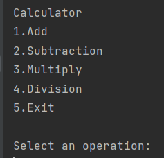

### Operation Add
En esta operacion va ejecutar la suma de dos numeros enteros.
Tendras que teclear el primer numero, oprimir enter y teclear un segundo numero de entrada, al dar enter automaticamente te realizara la suma de esos numeros
mostrandote en pantalla el resultado.

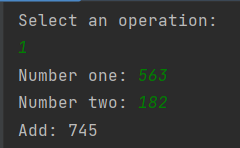


### Operation Subtraction

Esta operacion realiza la resta de dos numeros enteros.
Tendras que dar dos numeros enteros de entrada y oprimir enter, automaticamente te realizara la resta y
mostrara el resultado en pantalla.

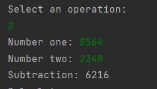

### Operation Multiply
Esta opcion realiza la multiplicacion de dos numeros enteros los cuales tendras que teclear, oprimirr enter y te mostrara el 
resultado automaticamente.

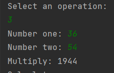

### Operation Division
Esta operacion realiza la division de dos numeros enteros.
Tendras que darle dos numeros de entrada y al dar enter te muestra el resultado de esa division en
numeros enteros.

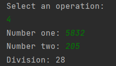

### Exit
La operation exit da por terminada la ejecucion del programa.

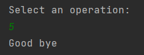

### Nota:
Si por error tecleamos un numero que no esta dentro de las opciones, nos va pedir que por favor teclemos una
operacion correcta.

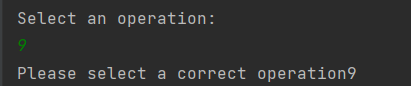

## Refactorización

* Se puede quitar el while y crear una clase.
 ````
while (true) {
            System.out.println("Calculator");
            System.out.println("""
                    1.Add
                    2.Subtraction
                    3.Multiply
                    4.Division
                    5.Exit
                    """);
            System.out.println("Select an operation: ");
            var operation = Integer.parseInt(digits.nextLine());
            if (operation >= 1 && operation <=4){
                System.out.print("Number one: ");
                var numberone = Integer.parseInt(digits.nextLine());
                System.out.print("Number two: ");
                var numbertwo = Integer.parseInt(digits.nextLine());
                int result;
                switch (operation){
                    case 1 ->{
                        result = numberone + numbertwo;
                        System.out.println("Add: " + result);
                    }
                    case 2 ->{
                        result = numberone - numbertwo;
                        System.out.println("Subtraction: " + result);
                    }
                    case 3 ->{
                        result = numberone * numbertwo;
                        System.out.println("Multiply: " + result);
                    }
                    case 4 ->{
                        result = numberone / numbertwo;
                        System.out.println("Division: " + result);
                    }
                    default -> System.out.println("Error" + operation);
                }
            } else if (operation == 5) {
                System.out.println("Good bye");
                break;
            }else {
                System.out.println("Please select a correct operation" + operation);
            }
        }

````
* la sintaxis del switch, cada case: debe llevar dos puntos y un break;


* Hacer que acepte numeros decimales y no solo numeros enteros.

  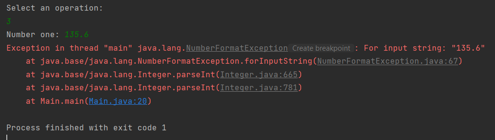

* Validar que no acepte letras solo numeros

  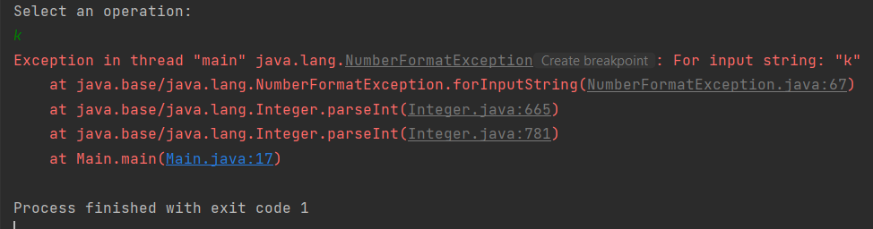

* No acepta numeros muy largos

  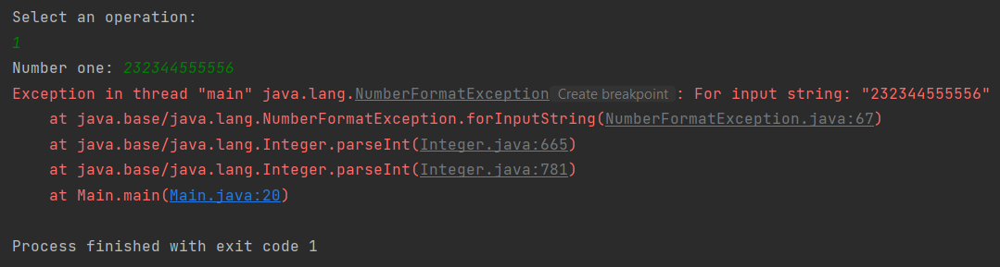

* Utilizar camelCase para la declaración de variables cuando la variable esta formada de dos palabras o más.

  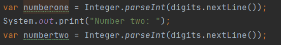

   